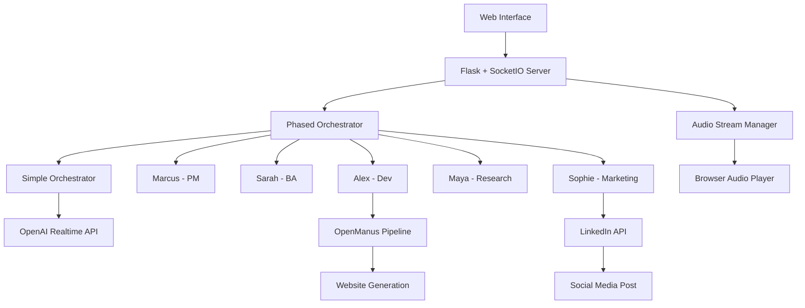

# 🚀 Moentreprise

<p align="center">
  
</p>

<p align="center">
  <strong>AI-Powered Business Automation Platform</strong>
</p>

<p align="center">
  <a href="#features">Features</a> •
  <a href="#quick-start">Quick Start</a> •
  <a href="#architecture">Architecture</a> •
  <a href="#personas">AI Team</a> •
  <a href="#api">API</a> •
  <a href="#contributing">Contributing</a>
</p>

---

## 🎯 What is Moentreprise?

Moentreprise is a revolutionary AI business automation platform that orchestrates a team of specialized AI agents to handle complete business projects from conception to launch. Using OpenAI's Realtime API, it provides seamless voice interactions, real-time development, and automated marketing - all working together as a cohesive team.

### 🌟 Key Capabilities

- **🤖 AI Team Collaboration**: Five specialized AI personas work together seamlessly
- **🎤 Real-time Voice Interaction**: Natural conversations with instant audio responses
- **💻 Automated Development**: From requirements to deployed website in minutes
- **📱 LinkedIn Marketing**: Automated social media campaigns with AI-generated content
- **🔄 Dynamic Workflow**: Intelligent task handoffs between team members

## 🚀 Quick Start

### Prerequisites

- Python 3.8+
- Node.js 16+ and npm
- OpenAI API key with Realtime API access
- LinkedIn API credentials (for marketing features)
- FFmpeg for audio processing

### Installation

1. **Clone the repository**
   ```bash
   git clone https://github.com/yourusername/moentreprise.git
   cd moentreprise
   ```

2. **Set up Python environment**
   ```bash
   python -m venv venv
   source venv/bin/activate  # On Windows: venv\Scripts\activate
   pip install -r requirements.txt
   ```

3. **Configure environment variables**
   ```bash
   cp env.example .env
   # Edit .env with your credentials:
   # - OPENAI_API_KEY
   # - LINKEDIN_ACCESS_TOKEN
   # - LINKEDIN_AUTHOR_ID
   # - LINKEDIN_ORG_ID
   ```

4. **Clear ports (if needed)**
   ```bash
   python clear_ports.py
   ```

5. **Launch Moentreprise**
   ```bash
   cd examples
   python web_demo.py
   ```

6. **Open your browser**
   Navigate to `http://localhost:3001`

## 👥 Meet Your AI Business Team

### 🧑‍💼 Marcus - Project Manager
- **Role**: Orchestrates the entire project lifecycle
- **Responsibilities**: Client greeting, team coordination, project closure
- **Voice**: Professional and authoritative (alloy)

### 👩‍💻 Sarah - Business Analyst  
- **Role**: Requirements gathering specialist
- **Responsibilities**: Client interviews, needs assessment, documentation
- **Voice**: Friendly and approachable (sage)

### 👨‍💻 Alex - Full-Stack Developer
- **Role**: Technical implementation expert
- **Responsibilities**: Website development, deployment, showcase
- **Voice**: Enthusiastic and technical (coral)

### 👩‍🔬 Maya - Research Specialist
- **Role**: Market research and analysis
- **Responsibilities**: Competitor analysis, design inspiration, best practices
- **Voice**: Analytical and thorough (sage)

### 👩‍🎨 Sophie - Marketing Director
- **Role**: Digital marketing specialist
- **Responsibilities**: LinkedIn campaigns, content creation, social media launch
- **Voice**: Creative and persuasive (sage)

## 🏗️ Architecture

### System Overview



### Core Components

#### 1. **Orchestration System**
- `simple_orchestrator.py`: Base orchestration logic
- `phased_orchestrator.py`: Business workflow management
- Real-time WebSocket communication
- Dynamic speaker selection

#### 2. **Web Interface**
- Modern, professional UI with Mo branding
- Real-time audio streaming
- Voice input capabilities
- Live terminal output display

#### 3. **Development Pipeline**
- `web_tools.py`: Website generation utilities
- `vibe_code_executor`: Automated build system
- OpenManus integration for AI-powered development

#### 4. **Marketing Automation**
- `linkedin_marketer.py`: LinkedIn integration
- DALL-E image generation
- Automated post creation and publishing

### Workflow Phases

1. **Greeting Phase**: Marcus welcomes the client
2. **Interview Phase**: Sarah gathers requirements
3. **Research Phase**: Maya analyzes market and competitors
4. **Development Phase**: Alex builds the website
5. **Marketing Phase**: Sophie creates LinkedIn campaign
6. **Closing Phase**: Marcus wraps up the project

## 📡 API Reference

### WebSocket Events

#### Client → Server
- `start_orchestrator`: Begin new project session
- `stop_orchestrator`: End current session
- `human_audio`: Submit voice input

#### Server → Client
- `persona_started`: AI team member begins speaking
- `audio_chunk`: Streaming audio data
- `persona_finished`: Team member completed turn
- `terminal_chunk`: Development pipeline output
- `dev_server_ready`: Website preview available
- `conversation_complete`: Project finished

### REST Endpoints

```python
GET  /                    # Main web interface
GET  /mo-logo            # Mo logo asset
POST /start_orchestrator # Initialize AI team
POST /stop_orchestrator  # Stop current session
POST /human_audio       # Process voice input
GET  /status            # Current session status
```

## 🛠️ Configuration

### Environment Variables

```env
# OpenAI Configuration
OPENAI_API_KEY=your-api-key
OPENAI_REALTIME_MODEL=gpt-4o-realtime-preview

# LinkedIn Integration
LINKEDIN_ACCESS_TOKEN=your-token
LINKEDIN_AUTHOR_ID=your-author-id
LINKEDIN_ORG_ID=your-organization-id

# Optional Settings
OPENAI_VOICE=alloy
AUDIO_CHUNK_DURATION_MS=430
```

### Customizing AI Personas

Edit personas in `examples/web_demo.py`:

```python
PersonaConfig(
    name="CustomPersona",
    voice="alloy",
    instructions="Your persona's behavior...",
    temperature=0.7,
    max_response_tokens=1500
)
```

## 📊 Performance Metrics

- **Response Time**: < 500ms between speakers
- **Development Time**: 2-5 minutes for complete website
- **Audio Quality**: 24kHz PCM16 streaming
- **Concurrent Sessions**: Supports multiple projects

## 🐛 Troubleshooting

### Common Issues

1. **Port Already in Use**
   ```bash
   python clear_ports.py
   ```

2. **LinkedIn Posting Errors**
   - Verify access token is valid
   - Check organization permissions
   - Ensure content doesn't exceed limits

3. **Audio Not Playing**
   - Check browser microphone permissions
   - Verify FFmpeg installation
   - Clear browser cache

### Debug Mode

Enable detailed logging:
```python
logging.basicConfig(level=logging.DEBUG)
```

## 📁 Project Structure

```
moentreprise/
├── src/
│   ├── simple_orchestrator.py    # Core orchestration
│   ├── phased_orchestrator.py    # Business workflow
│   ├── personas/                 # AI team members
│   │   └── linkedin_marketer.py  # Sophie's module
│   └── web_tools.py              # Development utilities
├── examples/
│   └── web_demo.py               # Main application
├── resources/
│   └── Mo.png                    # Mo logo
├── docs/                         # Documentation
├── scripts/                      # Utility scripts
└── requirements.txt              # Dependencies
```

## 🤝 Contributing

We welcome contributions! Please see our [Contributing Guide](docs/CONTRIBUTING.md) for details.

1. Fork the repository
2. Create a feature branch (`git checkout -b feature/amazing-feature`)
3. Commit your changes (`git commit -m 'Add amazing feature'`)
4. Push to the branch (`git push origin feature/amazing-feature`)
5. Open a Pull Request

## 📄 License

This project is licensed under the MIT License - see the [LICENSE](LICENSE) file for details.

## 🙏 Acknowledgments

- OpenAI for the Realtime API
- The Flask and SocketIO communities
- All contributors who helped shape Moentreprise

---

<p align="center">
  Built with 💜 by Mo and the <a href="https://legml.ai">legml.ai</a> team
</p>

<p align="center">
  <strong>Transform your business ideas into reality with AI automation</strong>
</p>
